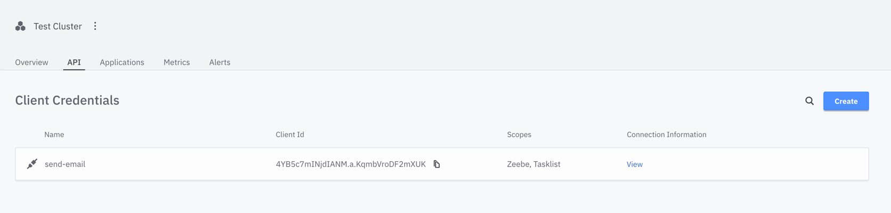
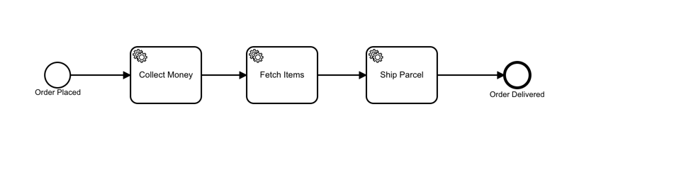
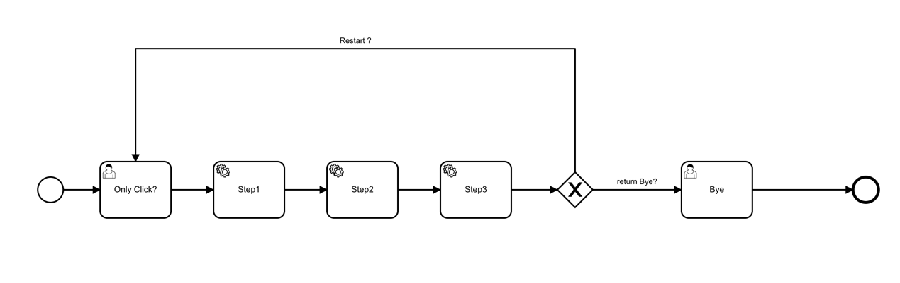

# zeebe-go-simple-example
zeebe golang simple example demo

## usage
[]

step1：register camunda cloud (free 30 days) or launch a local zeebe service  
https://console.cloud.camunda.io/signup

[](https://console.cloud.camunda.io)

step2: get environment variables

```shell
export ZEEBE_ADDRESS=xxx.bru-2.zeebe.camunda.io:443
export ZEEBE_CLIENT_ID=xxx
export ZEEBE_CLIENT_SECRET=xxx
export ZEEBE_AUTHORIZATION_SERVER_URL=https://login.cloud.camunda.io/oauth/token
```

step3: seeting environment variables

dev: setting variables to ide

prod: export variables

## how to develop owner worker

step1: download desktop modeler (create bpmn camunda cloud bpmn pipeline)

[](https://camunda.com/download/modeler/)

step2: See the example in the Handle directory then register the jobWorker

step3: run main.go

## example
[](./bpmn/order-process.bpmn)
[](./bpmn/step1-2-3-click.bpmn)
